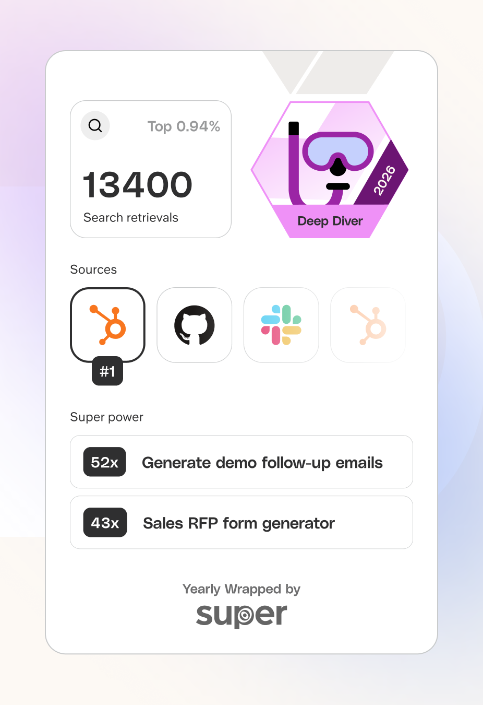

# Super EOY Wrapped 2026

A personalized End of Year Wrapped experience for Super, showcasing usage,
insights, sources, archetypes, and super powers.

**Live demo:** https://super-eoy-wrapped.vercel.app/



## What this is

This is a Next.js App Router project that renders a multi-page wrapped flow.
Copy and update the data in `data/superData.ts` to generate new users and
content.

## Key areas

- `data/superData.ts` — core data for each user
- `components/superDataProvider.tsx` — context + hooks for selected user data
- `components/insightBlock.tsx` — inline highlights and image inserts
- `app/*/page.tsx` — page layout per section

## Provider flow (wizard-style routes)

```mermaid
flowchart LR
  A[Route pages: /usage, /sources, /archetype, /super-power, /summary]
  B[SuperDataProvider]
  C[selectedUser state]
  D[data/superData.ts]
  E[useSuperData(username, topic)]
  F[Section data for page]

  A -->|consume provider| B
  B --> C
  B --> D
  A -->|request topic| E
  E -->|select by user + topic| D
  D --> F
  F --> A
```

## Local development

```bash
pnpm dev
```

Open [http://localhost:3000](http://localhost:3000).

## Customization notes

- Fonts are in `public/` and wired in `app/layout.tsx`.
- The favicon is generated from `public/Super_Symbol_Dark.svg`.
